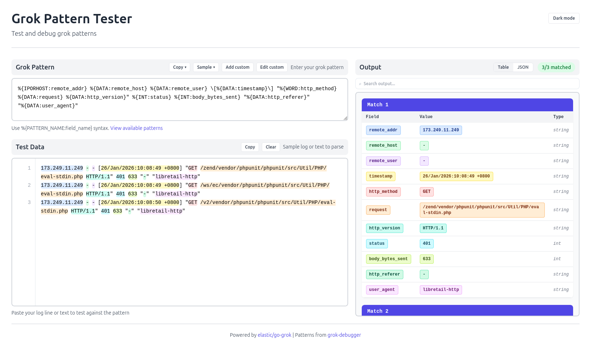
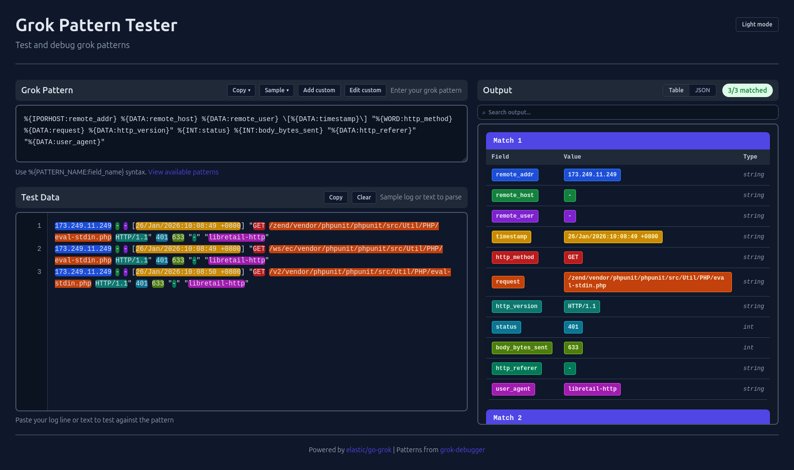

# Grok Pattern Tester

A web-based tool for testing and debugging [Grok patterns](https://www.elastic.co/guide/en/logstash/current/plugins-filters-grok.html) against log data in real time.

## Preview

**Light Theme**



**Dark Theme**



---

## Features

- Live pattern matching with instant feedback
- Syntax highlighting of matched fields in log lines
- Table and JSON output views
- Custom pattern management (add, edit, delete) per session
- Autocomplete for built-in and custom pattern names
- Escaped pattern support (paste patterns from JSON configs)
- Search/filter across matched results
- Nested field view for dot-notation and bracket-notation fields
- Light / Dark theme toggle
- Session state saved in the browser (survives page refresh for 7 days)

---

## Requirements

- [Go](https://go.dev/dl/) 1.24 or later

---

## Setup & Running

### 1. Clone the repository

```bash
git clone https://github.com/RyanRiz/grok-tester.git
cd grok-tester
```

### 2. Install dependencies

```bash
go mod download
```

### 3. Run the server

```bash
go run main.go
```

The server starts on **http://localhost:8080** by default.

### Custom port

Use the `-port` flag to run on a different port:

```bash
go run main.go -port 9090
```

### Build a binary

```bash
go build -o grok-tester .
./grok-tester -port 8080
```

---

## How to Use

### Testing a Pattern

1. Open your browser at `http://localhost:8080`
2. Enter a Grok pattern in the **Pattern** field, for example:
   ```
   %{IP:client_ip} %{WORD:method} %{URIPATHPARAM:request}
   ```
3. Paste one or more log lines into the **Test Data** area
4. Results appear automatically — matched fields are highlighted in the log lines and listed below

### Autocomplete

While typing in the Pattern field, pattern name suggestions will appear. Use **arrow keys** to navigate and **Enter** or **Tab** to insert.

### Pattern Copy Options

The **Copy** button next to the pattern field provides two formats:
- **Plain** — copies the pattern as-is
- **Escaped** — copies with backslashes doubled and quotes escaped, ready to paste into a JSON config string (e.g., Logstash pipeline JSON)

The **Sample** button works the same way but provides copy buttons after generating a sample from the matched data.

### Escaped Patterns

If you paste a pattern that was already escaped (e.g., copied from a JSON file), the tool will automatically detect and unescape it before matching. An **"Escaped"** badge will appear next to the pattern field when this happens.

### Output Views

- **Table** — shows each matched line with a row of field/value pairs
- **JSON** — shows all matches as a JSON array

Use the **Nested** toggle to expand dot-notation fields (e.g., `http.method`) into nested JSON objects.

Use the **Search** box to filter results by field name or value.

### Custom Patterns

Click **Add Custom Pattern** (or the edit icon) to open the custom pattern manager:

- **Name** — uppercase letters, digits, and underscores only (e.g., `MY_PATTERN`)
- **Pattern** — any valid Grok/regex pattern; you can reference other built-in pattern names using `%{PATTERN_NAME}`
- Custom patterns are available immediately in the Pattern field autocomplete
- Custom patterns are **session-scoped** — they persist in your browser session and are stored server-side in `/tmp/grok-tester-custom-patterns/` for up to **7 days**

---

## Built-in Pattern Libraries

The following pattern sets are bundled and available out of the box:

| Library | Examples |
|---|---|
| Core | `IP`, `HOSTNAME`, `INT`, `NUMBER`, `WORD`, `UUID`, `URI`, `LOGLEVEL`, `HTTPDATE`, … |
| AWS | CloudTrail, ELB, S3 |
| Bacula | Bacula backup logs |
| BIND | DNS query/response logs |
| Bro / Zeek | Network logs |
| Exim | Mail transfer logs |
| Firewalls | Cisco ASA, iptables, Netscreen |
| HAProxy | Request and error logs |
| HTTPD | Apache common/combined/error logs |
| Java | Java exceptions and stack traces |
| JunOS | Juniper routing logs |
| Linux Syslog | Syslog, authlog |
| Maven | Build output |
| MCollective | Orchestration logs |
| MongoDB | Query and operation logs |
| Nagios | Alert and service logs |
| Postfix | SMTP logs |
| PostgreSQL | Query logs |
| Rails | Ruby on Rails request logs |
| Redis | Server logs |
| Ruby | Ruby errors and stack traces |
| Squid | Proxy access logs |

---

## API Reference

The server exposes a simple REST API, which the frontend uses internally.

| Method | Endpoint | Description |
|---|---|---|
| `POST` | `/api/test` | Test a pattern against data |
| `GET` | `/api/patterns` | List all available built-in pattern names |
| `GET` | `/api/custom-patterns` | List custom patterns for the current session |
| `POST` | `/api/custom-patterns` | Add a new custom pattern |
| `PUT` | `/api/custom-patterns/:name` | Update an existing custom pattern |
| `DELETE` | `/api/custom-patterns/:name` | Delete a custom pattern |

### POST /api/test

**Request body:**
```json
{
  "pattern": "%{IP:client_ip} %{WORD:method}",
  "testData": "192.168.1.1 GET\n10.0.0.1 POST"
}
```

**Response:**
```json
{
  "success": true,
  "matches": [
    { "fields": { "client_ip": "192.168.1.1", "method": "GET" }, "line": "192.168.1.1 GET", "lineIndex": 0 }
  ],
  "total": 2,
  "matched": 1,
  "fieldOrder": ["client_ip", "method"]
}
```

---

## Configuration

There is no configuration file. All options are passed as CLI flags or handled automatically:

| Item | Default | How to change |
|---|---|---|
| Server port | `8080` | `-port <number>` flag |
| Custom pattern storage | `/tmp/grok-tester-custom-patterns/` | Edit `customPatternCacheDir` in `grokmanager/manager.go` |
| Custom pattern TTL | 7 days | Edit `sessionPatternTTL` in `grokmanager/manager.go` |
| Pattern compilation timeout | 2 seconds | Edit `CompileTimeout` in `grokmanager/manager.go` |
| Max pattern size | 1 MB | Edit `MaxPatternSize` in `grokmanager/manager.go` |
| Session cookie lifetime | 30 days | Edit `SetCookie` call in `handlers/api.go` |

---

## Project Structure

```
grok-tester/
├── main.go                  # Entry point; routes and server setup
├── go.mod                   # Go module definition
├── handlers/
│   └── api.go               # HTTP handlers for all API endpoints
├── grokmanager/
│   ├── manager.go           # Core grok logic, session management, custom patterns
│   └── patterns/            # Bundled pattern definition files
├── templates/
│   └── index.tmpl           # HTML template for the UI
├── static/
│   ├── css/style.css        # Styles
│   └── js/app.js            # Frontend logic
└── asset/
    ├── light.png            # Light theme screenshot
    └── dark.png             # Dark theme screenshot
```